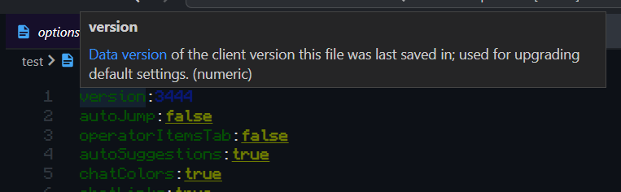

# Minecraft options.txt

A simple extension which provides information for Minecraft's configuration file.

## Features

### Syntax Highlighting

The extension provides a grammar for highlighting Minecraft's options.txt files.
Below are screenshots demonstrating the colorization.
(Colors will be based on your own color theme, but should be similar to JSON highlighting.)

| Before | After |
| :---: | :---: |
|  |  |

This feature will automatically trigger for files with the names `options.txt` and `optionsof.txt` (for OptiFine).

### Intellisense (sort of)

The extension has been loaded with information about the various options and what they do.
Hovering over text in a line will provide a hover note with a short blurb about what that option controls (taken from the [Minecraft Wiki page][fandom/options.txt/je]).

This feature is not complete in this release, but version `1.0.0` will have information concerning all of the vanilla options.

[fandom/options.txt/je]: https://minecraft.wiki/w/Options.txt#Java_Edition
